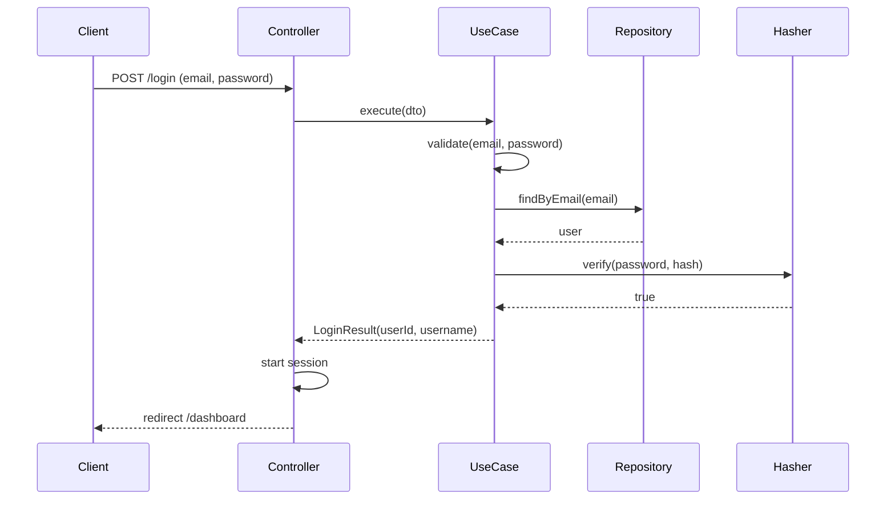

# UC-AUTH-003: Login

## Overview
A user logs in with an email and a password. The system checks the credentials, refuses a suspended or unverified account, reactivates a self-deactivated account, and starts a session.

## Actors
- Primary: User
- Secondary: System

## Preconditions
- P1: The user is not authenticated.
- P2: The user has an account with a known email and password.

## Postconditions
- PS1: A session exists for the authenticated user.
- PS2: A self-deactivated account is back in the `active` state.

## Main Flow
1. The client submits the email and the password.
2. The controller passes them to the use case.
3. The use case validates the shape of the email and the password.
4. The use case loads the user by email.
5. The use case checks that the user exists.
6. The use case verifies the password.
7. The use case checks that the account is active.
8. The use case returns the user id and username.
9. The controller starts the session and redirects to the dashboard.



## Alternate Flows
- AF-1: The email or password is empty or malformed. The use case collects every field error and throws `ValidationException`.

  ```mermaid
  sequenceDiagram
      Client->>Controller: POST /login (email, password)
      Controller->>UseCase: execute(dto)
      UseCase->>UseCase: validate(email, password)
      Note over UseCase: shape errors
      UseCase-->>Controller: ValidationException
      Controller-->>Client: render login with field errors
  ```

- AF-2: No user has the email, the password is wrong, or the account is suspended. The use case throws `InvalidCredentialsException`. The message does not say which check failed.

  ```mermaid
  sequenceDiagram
      Client->>Controller: POST /login (email, password)
      Controller->>UseCase: execute(dto)
      UseCase->>Repository: findByEmail(email)
      Repository-->>UseCase: null OR wrong password OR suspended
      UseCase-->>Controller: InvalidCredentialsException
      Controller-->>Client: render login with form error
  ```

- AF-3: The account is unverified. The use case throws `EmailNotVerifiedException`.

  ```mermaid
  sequenceDiagram
      Client->>Controller: POST /login (email, password)
      Controller->>UseCase: execute(dto)
      UseCase->>Repository: findByEmail(email)
      Repository-->>UseCase: user
      UseCase->>Hasher: verify(password, hash)
      Hasher-->>UseCase: true
      Note over UseCase: account is unverified
      UseCase-->>Controller: EmailNotVerifiedException
      Controller-->>Client: render login with form error
  ```

- AF-4: The account is self-deactivated. The use case reactivates it in one transaction, then returns the result.

  ```mermaid
  sequenceDiagram
      Client->>Controller: POST /login (email, password)
      Controller->>UseCase: execute(dto)
      UseCase->>Repository: findByEmail(email)
      Repository-->>UseCase: user (self-deactivated)
      UseCase->>Hasher: verify(password, hash)
      Hasher-->>UseCase: true
      UseCase->>UnitOfWork: execute(work)
      UnitOfWork->>Repository: updateAccountState(user)
      UnitOfWork-->>UseCase: done
      UseCase-->>Controller: LoginResult(userId, username)
      Controller-->>Client: redirect /dashboard
  ```

## Business Rules
- BR-1: The use case validates the shape of the email and the password before it reads the database.
- BR-2: A missing user, a wrong password, and a suspended account all produce the same `InvalidCredentialsException`. The response does not leak which check failed.
- BR-3: The use case refuses an unverified account with `EmailNotVerifiedException`.
- BR-4: The use case reactivates a self-deactivated account on a successful login.