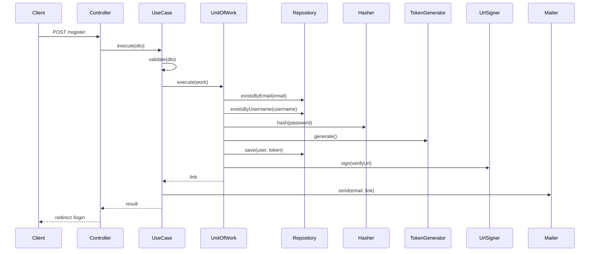

# UC-AUTH-001: Register User

## Overview
A guest creates an account. The system stores a verification token and sends a signed verification link by email.

## Actors
- Primary: Guest
- Secondary: System

## Preconditions
- P1: The guest is not authenticated.
- P2: The email has a valid format.
- P3: The username meets the format rules.
- P4: The password meets the complexity rules.

## Postconditions
- PS1: A user account exists in the `unverified` state.
- PS2: A verification token exists for the user.
- PS3: A verification email is sent with the signed link.

## Main Flow
1. The client submits the registration form.
2. The controller passes the request to the use case.
3. The use case validates the registration input.
4. The use case starts one transaction.
5. The use case checks that the email is free.
6. The use case checks that the username is free.
7. The use case hashes the password.
8. The use case generates the verification token.
9. The use case saves the user and the token.
10. The use case signs the verification URL.
11. The transaction commits.
12. The use case sends the verification email.
13. The use case returns the verification link to the controller.
14. The controller redirects the client to the login page.



## Alternate Flows
- AF-1: The email is in use. The use case throws `EmailAlreadyExistsException`.

  ```mermaid
  sequenceDiagram
      Client->>Controller: POST /register
      Controller->>UseCase: execute(dto)
      UseCase->>UseCase: validate(dto)
      UseCase->>UnitOfWork: execute(work)
      UnitOfWork->>Repository: existsByEmail(email)
      Repository-->>UnitOfWork: true
      Note over UnitOfWork: transaction rolls back
      UnitOfWork-->>UseCase: EmailAlreadyExistsException
      UseCase-->>Controller: EmailAlreadyExistsException
      Controller-->>Client: render register (errors)
  ```

- AF-2: The username is in use. The use case throws `UsernameAlreadyExistsException`.

  ```mermaid
  sequenceDiagram
      Client->>Controller: POST /register
      Controller->>UseCase: execute(dto)
      UseCase->>UseCase: validate(dto)
      UseCase->>UnitOfWork: execute(work)
      UnitOfWork->>Repository: existsByEmail(email)
      Repository-->>UnitOfWork: false
      UnitOfWork->>Repository: existsByUsername(username)
      Repository-->>UnitOfWork: true
      Note over UnitOfWork: transaction rolls back
      UnitOfWork-->>UseCase: UsernameAlreadyExistsException
      UseCase-->>Controller: UsernameAlreadyExistsException
      Controller-->>Client: render register (errors)
  ```

- AF-3: The input fails validation. The use case throws `ValidationException` with the field errors.

  ```mermaid
  sequenceDiagram
      Client->>Controller: POST /register
      Controller->>UseCase: execute(dto)
      UseCase->>UseCase: validate(dto)
      Note over UseCase: input invalid
      UseCase-->>Controller: ValidationException
      Controller-->>Client: render register (errors)
  ```

## Business Rules
- BR-1: The email must be unique across all users.
- BR-2: The username must be unique across all users.
- BR-3: The password must meet the complexity rules.
- BR-4: A new account starts in the `unverified` state.
- BR-5: The verification link is signed and expires with the token.