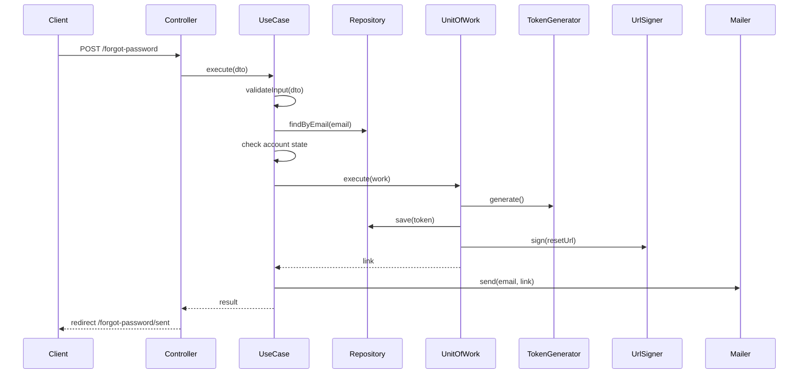

# UC-AUTH-004: Request Password Reset

## Overview
A user who forgot their password asks for a reset link. The system stores a reset token and sends a signed reset link by email when the account is active or self-deactivated.

## Actors
- Primary: Guest (any visitor)
- Secondary: System

## Preconditions
- P1: The visitor is not authenticated.
- P2: The email has a valid format.

## Postconditions
- PS1: For an active or self-deactivated user, a password reset token exists and a reset email is sent.
- PS2: For a non-existent, suspended, or unverified email, no token exists and no email is sent.
- PS3: The response is the same confirmation page in every case, so the email existence is not leaked.

## Main Flow
1. The client submits the forgot-password form.
2. The controller passes the request to the use case.
3. The use case validates the email shape.
4. The use case loads the user by email.
5. The use case checks that the account is active or self-deactivated.
6. The use case starts one transaction.
7. The use case generates the reset token.
8. The use case saves the token.
9. The use case signs the reset URL.
10. The transaction commits.
11. The use case sends the reset email.
12. The controller redirects the client to the sent page.



## Alternate Flows
- AF-1: The email shape is invalid. The use case throws `ValidationException`. The controller re-renders the form with the email error.

  ```mermaid
  sequenceDiagram
      Client->>Controller: POST /forgot-password
      Controller->>UseCase: execute(dto)
      UseCase->>UseCase: validateInput(dto)
      UseCase-->>Controller: ValidationException
      Controller-->>Client: render form with email error
  ```

- AF-2: No user has the email, or the account is suspended or unverified. The use case returns a null link and sends nothing. The controller still redirects to the sent page.

  ```mermaid
  sequenceDiagram
      Client->>Controller: POST /forgot-password
      Controller->>UseCase: execute(dto)
      UseCase->>Repository: findByEmail(email)
      UseCase-->>Controller: null link
      Controller-->>Client: redirect /forgot-password/sent
  ```

## Business Rules
- BR-1: Only an active or self-deactivated account can receive a reset link.
- BR-2: A non-existent, suspended, or unverified email gets the same confirmation page and no email, so the email existence is not leaked.
- BR-3: The reset token expires after the configured time to live (30 minutes).
- BR-4: The reset link is a signed URL. The signature and the expiry are checked on use.