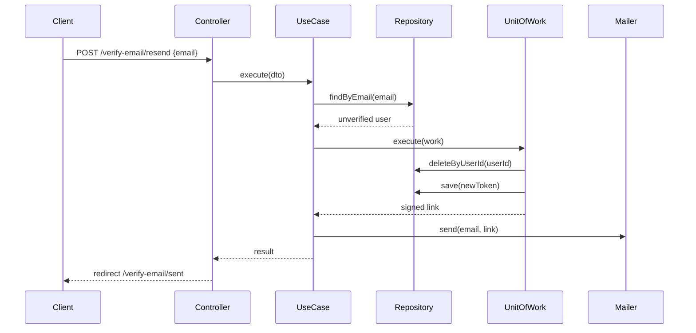

# UC-AUTH-006: Resend Verification Email

## Overview
A person who did not get the verification email, or whose link expired, enters an email address. The system sends a new verification link to an unverified account. It gives the same response for any other case so the response leaks no account information.

## Actors
- Primary: Guest
- Secondary: System

## Preconditions
- P1: The person enters an email address in the resend form.

## Postconditions
- PS1: For an unverified account, the old verification token is deleted and a new one is saved.
- PS2: For an unverified account, a verification email with a signed link is sent.
- PS3: The response is the same whether or not the account exists and is unverified.

## Main Flow
1. The client submits the resend form with an email.
2. The controller passes the email to the use case.
3. The use case checks the email shape.
4. The use case loads the user for the email.
5. The use case checks that the account is unverified.
6. The use case starts one transaction.
7. The use case deletes the old verification token.
8. The use case issues a new verification token.
9. The use case builds the signed verification link.
10. The transaction commits.
11. The use case sends the verification email.
12. The controller redirects the client to the sent page.



## Alternate Flows
- AF-1: The email shape is invalid. The use case throws `ValidationException`. The controller re-renders the form with the error.

  ```mermaid
  sequenceDiagram
      Client->>Controller: POST /verify-email/resend {email}
      Controller->>UseCase: execute(dto)
      UseCase-->>Controller: ValidationException
      Controller-->>Client: render resend-verification-email with errors
  ```

- AF-2: No user has the email, or the account is already verified. The use case returns a null result and sends no email. The controller still redirects to the sent page, so the response leaks nothing.

  ```mermaid
  sequenceDiagram
      Client->>Controller: POST /verify-email/resend {email}
      Controller->>UseCase: execute(dto)
      UseCase->>Repository: findByEmail(email)
      Repository-->>UseCase: null or verified user
      UseCase-->>Controller: null result
      Controller-->>Client: redirect /verify-email/sent
  ```

## Business Rules
- BR-1: The email must pass the email shape check.
- BR-2: A resend is sent only to an account in the `unverified` state.
- BR-3: A missing user and an already-verified account produce the same response as a successful resend, so the response leaks no account information.
- BR-4: The old verification token is deleted before the new one is saved, so a user has at most one verification token at a time.
- BR-5: The verification link is a signed URL that expires after `VERIFICATION_TOKEN_TTL_SECONDS`.