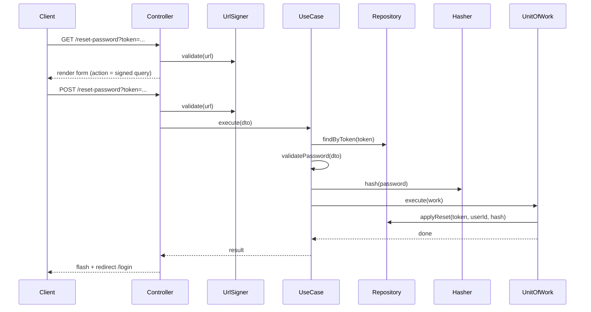

# UC-AUTH-005: Reset Password

## Overview
A user opens the signed reset link, chooses a new password, and the system updates the password and deletes the reset token.

## Actors
- Primary: Guest (the link owner)
- Secondary: System

## Preconditions
- P1: The visitor is not authenticated.
- P2: The reset link is signed and not expired (checked by the controller before the use case runs).
- P3: The reset token exists in the database and is not expired.
- P4: The new password meets the complexity rules and matches the confirm field.

## Postconditions
- PS1: The user's password hash is updated.
- PS2: The reset token is deleted (single use).
- PS3: The client is redirected to the login page with a flash.

## Main Flow
1. The client opens the signed reset link.
2. The controller validates the signature and the expiry.
3. The controller renders the reset form with the signed query in the form action.
4. The client submits the new password and the confirm field.
5. The controller re-validates the signature and the expiry.
6. The controller passes the token and the passwords to the use case.
7. The use case loads the token and checks the expiry.
8. The use case validates the new password.
9. The use case hashes the new password.
10. The use case starts one transaction.
11. The use case updates the password hash and deletes the token.
12. The transaction commits.
13. The controller sets a flash and redirects to the login page.



## Alternate Flows
- AF-1: The signature is invalid or the link is expired. The controller renders the error page. The use case does not run.

  ```mermaid
  sequenceDiagram
      Client->>Controller: GET/POST /reset-password?...
      Controller->>UrlSigner: validate(url)
      UrlSigner-->>Controller: invalid
      Controller-->>Client: render error page
  ```

- AF-2: The token is missing or expired in the database. The use case throws `TokenNotFoundException` or `TokenExpiredException`. The controller renders the error page.

  ```mermaid
  sequenceDiagram
      Client->>Controller: POST /reset-password?token=...
      Controller->>UrlSigner: validate(url)
      Controller->>UseCase: execute(dto)
      UseCase->>Repository: findByToken(token)
      UseCase-->>Controller: TokenNotFound/TokenExpired
      Controller-->>Client: render error page
  ```

- AF-3: The new password is weak or does not match the confirm field. The use case throws `ValidationException`. The controller re-renders the form with the field errors and the signed action.

  ```mermaid
  sequenceDiagram
      Client->>Controller: POST /reset-password?token=...
      Controller->>UseCase: execute(dto)
      UseCase->>UseCase: validatePassword(dto)
      UseCase-->>Controller: ValidationException
      Controller-->>Client: render form with errors
  ```

## Business Rules
- BR-1: The reset token is checked before the password, so an expired link shows the error page, not password field errors.
- BR-2: The reset token is single use. A reused or consumed link is treated as not found.
- BR-3: The new password meets the same complexity rules as registration.
- BR-4: Reset does not reactivate a self-deactivated account. The user logs in with the new password, and login reactivates.
- BR-5: Reset does not end the user's other sessions in this iteration. That is deferred.