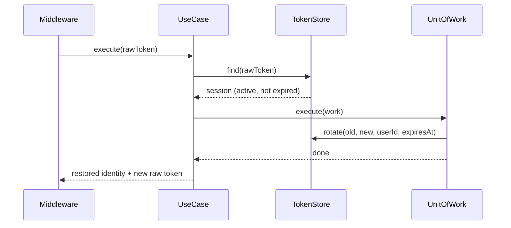

# UC-AUTH-007: Restore Remember-me Session

## Overview
A person comes back to the site with a remember-me cookie but no live session. The system checks the cookie against the stored token. When the token is valid and the account is active, the system starts a session and issues a new token. When the token is missing, expired, or the account is not active, the system restores nothing.

## Actors
- Primary: System (runs on every request, before the current-user middleware)
- Secondary: Returning user

## Preconditions
- P1: The request has no `userId` in the session.
- P2: The request has a `remember_me` cookie.

## Postconditions
- PS1: For a valid token and an active account, a new token replaces the old one and the restored identity is returned.
- PS2: For a missing or expired token, no session is restored and no token is revoked.
- PS3: For a valid token on a non-active account, the token is revoked and no session is restored.

## Main Flow
1. The middleware passes the cookie value to the use case.
2. The use case loads the session for the token.
3. The use case checks that the token is not expired.
4. The use case checks that the account is active.
5. The use case starts one transaction.
6. The use case deletes the old token and saves a new token.
7. The transaction commits.
8. The use case returns the restored identity and the new raw token.



## Alternate Flows
- AF-1: No token matches the cookie. The use case returns null. The middleware clears the cookie.

  ```mermaid
  sequenceDiagram
      Middleware->>UseCase: execute(rawToken)
      UseCase->>TokenStore: find(rawToken)
      TokenStore-->>UseCase: null
      UseCase-->>Middleware: null
  ```

- AF-2: The token is expired. The use case returns null without revoking. The middleware clears the cookie.

  ```mermaid
  sequenceDiagram
      Middleware->>UseCase: execute(rawToken)
      UseCase->>TokenStore: find(rawToken)
      TokenStore-->>UseCase: session (expired)
      UseCase-->>Middleware: null
  ```

- AF-3: The account is not active. The use case revokes the token and returns null. The middleware clears the cookie.

  ```mermaid
  sequenceDiagram
      Middleware->>UseCase: execute(rawToken)
      UseCase->>TokenStore: find(rawToken)
      TokenStore-->>UseCase: session (not active)
      UseCase->>TokenStore: revoke(rawToken)
      UseCase-->>Middleware: null
  ```

## Business Rules
- BR-1: Only an account in the `active` state can be restored through remember-me. `suspended`, `unverified`, and `self-deactivated` accounts cannot. (Login reactivates a `self-deactivated` account; remember-me does not.)
- BR-2: The token is single-use: a successful restore deletes the old token and issues a new one.
- BR-3: The database stores only the sha-256 hash of the raw token. The raw token lives only in the cookie.
- BR-4: An expired token is not revoked; it is inert because the raw token leaves the cookie.
- BR-5: The new token expires after `REMEMBER_ME_TOKEN_TTL_SECONDS`.