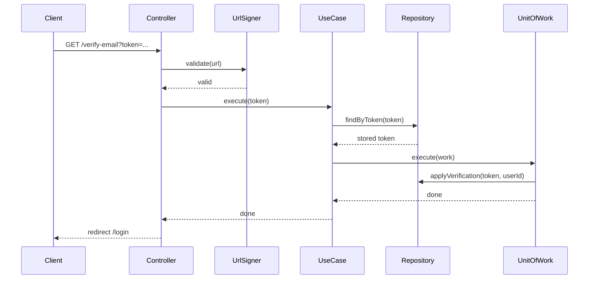

# UC-AUTH-002: Verify Email

## Overview
A guest opens the signed verification link from the registration email. The system checks the token, marks the account as verified and active, and clears the token.

## Actors
- Primary: Guest
- Secondary: System

## Preconditions
- P1: The guest is not authenticated.
- P2: The guest has a signed verification link from the registration email.

## Postconditions
- PS1: The user account is in the `active` state.
- PS2: The user's email is marked as verified.
- PS3: The verification token is deleted.

## Main Flow
1. The client opens the verification link.
2. The controller validates the signed URL.
3. The controller passes the token to the use case.
4. The use case loads the token.
5. The use case checks that the token exists.
6. The use case checks that the token is not expired.
7. The use case starts one transaction.
8. The use case marks the user as verified and active.
9. The use case deletes the token.
10. The transaction commits.
11. The controller redirects the client to the login page.



## Alternate Flows
- AF-1: The signed URL is invalid or has expired. The controller renders the error page without calling the use case.

  ```mermaid
  sequenceDiagram
      Client->>Controller: GET /verify-email?token=...
      Controller->>UrlSigner: validate(url)
      UrlSigner-->>Controller: not valid
      Controller-->>Client: render verify-email-error
  ```

- AF-2: The token does not exist. The use case throws `TokenNotFoundException`.

  ```mermaid
  sequenceDiagram
      Client->>Controller: GET /verify-email?token=...
      Controller->>UrlSigner: validate(url)
      UrlSigner-->>Controller: valid
      Controller->>UseCase: execute(token)
      UseCase->>Repository: findByToken(token)
      Repository-->>UseCase: null
      UseCase-->>Controller: TokenNotFoundException
      Controller-->>Client: render verify-email-error
  ```

- AF-3: The token is expired. The use case throws `TokenExpiredException`.

  ```mermaid
  sequenceDiagram
      Client->>Controller: GET /verify-email?token=...
      Controller->>UrlSigner: validate(url)
      UrlSigner-->>Controller: valid
      Controller->>UseCase: execute(token)
      UseCase->>Repository: findByToken(token)
      Repository-->>UseCase: stored token
      Note over UseCase: token is expired
      UseCase-->>Controller: TokenExpiredException
      Controller-->>Client: render verify-email-error
  ```

## Business Rules
- BR-1: The signed URL must pass signature and expiry checks before the token is read.
- BR-2: A missing token is rejected with `TokenNotFoundException`.
- BR-3: An expired token is rejected with `TokenExpiredException`.
- BR-4: The account moves from `unverified` to `active` when the email is verified.
- BR-5: The verification token is single-use: it is deleted when the account is verified.